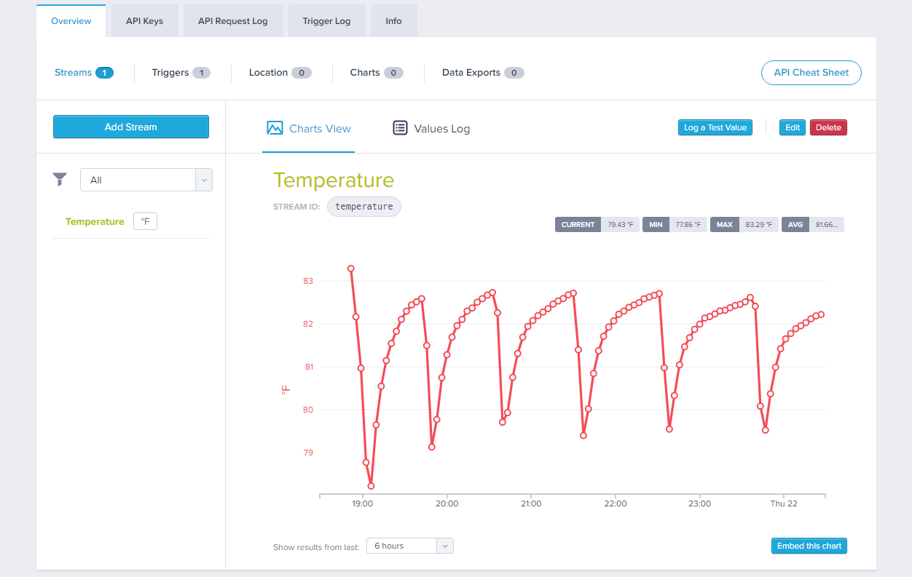

AT&T M2X Tessel Temperature
===========================
This project contains two sample AT&T M2X applications for the Tessel 2. The project uses the Tessel Climate module as a temperature sensor and loads the data into a M2X Stream. The project consists of the following files:

+ `config.js` - Contains M2X configuration settings.
+ `temp_sdk.js` - Uploads temperature data to M2X using the M2X Tessel SDK
+ `temp_http.js` - Uploads temperature data to M2X using HTTP (through the M2X REST API)

Populate the `config.js` file with settings for your particular M2X account and the Device you've defined in M2X then run the code. 

Temperature data recorded in AT&T M2X:

 

***

You can find information on many different topics on my [personal blog](http://www.johnwargo.com). Learn about all of my publications at [John Wargo Books](http://www.johnwargobooks.com).

If you find this code useful and feel like thanking me for providing it, please consider <a href="https://www.buymeacoffee.com/johnwargo" target="_blank">Buying Me a Coffee</a>, or making a purchase from [my Amazon Wish List](https://amzn.com/w/1WI6AAUKPT5P9).
